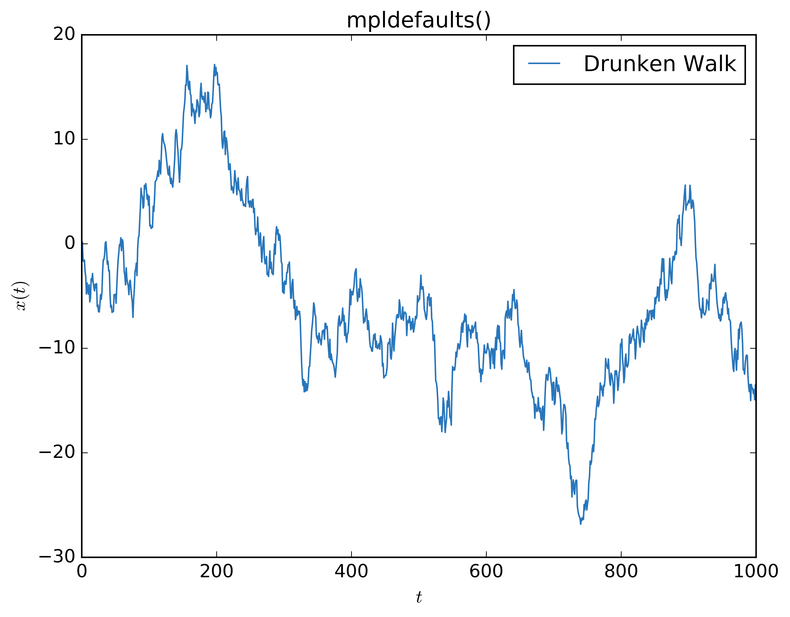

# Set Matplotlib RC parameters quickly

Some external documentation:

[Customizing Matplotlib](http://matplotlib.org/users/customizing.html)

## Examples
Imports:
``` python
import mikkelsen_mplrc as mkl
import numpy as np
import matplotlib.pyplot as plt

```


Generate random walk data:
```python
np.random.seed(42*42)
noise = np.random.randn(1000)
x = np.cumsum(noise)
bluish = '#2976bb' # https://xkcd.com/color/rgb/
```


### `paper()`
```python
mkl.paper()

fig1, ax1 = plt.subplots(1, 1)
ax1.plot(x, label='Drunken Walk', c=bluish)
ax1.set_xlabel(r'$t$')
ax1.set_ylabel(r'$x(t)$')
ax1.set_title(r'paper()')
ax1.legend()
```


### `presentation()`
```python
mkl.presentation()

fig2, ax2 = plt.subplots(1, 1)
ax2.plot(x, label='Drunken Walk', c=bluish)
ax2.set_xlabel(r'$t$')
ax2.set_ylabel(r'$x(t)$')
ax2.set_title(r'presentation()')
ax2.legend()
```


### `mpldefaults()`
```python
mkl.mpldefaults()

fig3, ax3 = plt.subplots(1, 1)
ax3.plot(x, label='Drunken Walk', c=bluish)
ax3.set_xlabel(r'$t$')
ax3.set_ylabel(r'$x(t)$')
ax3.set_title('mpldefaults()')
ax3.legend()
```


